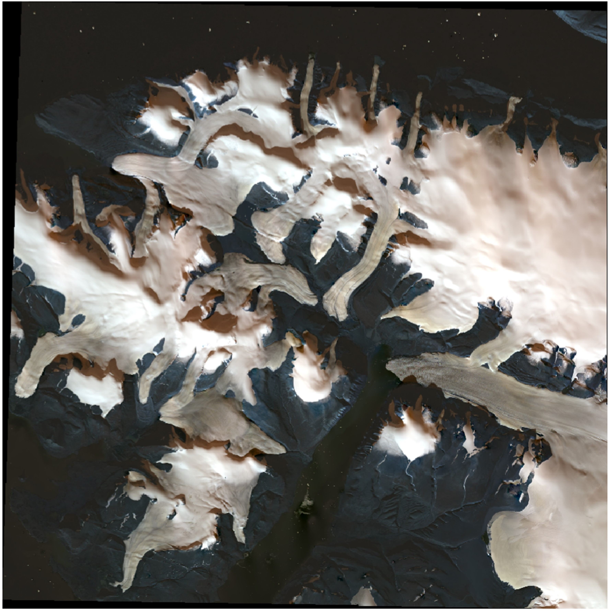
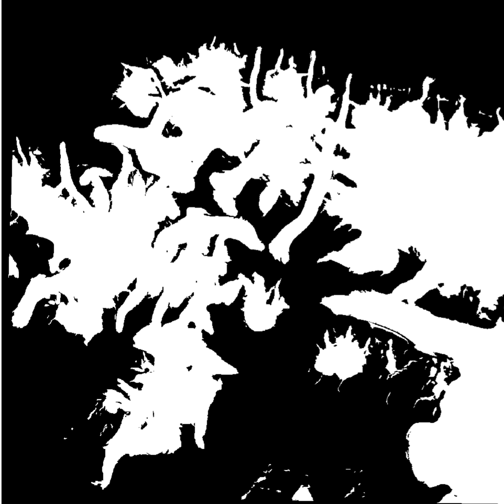
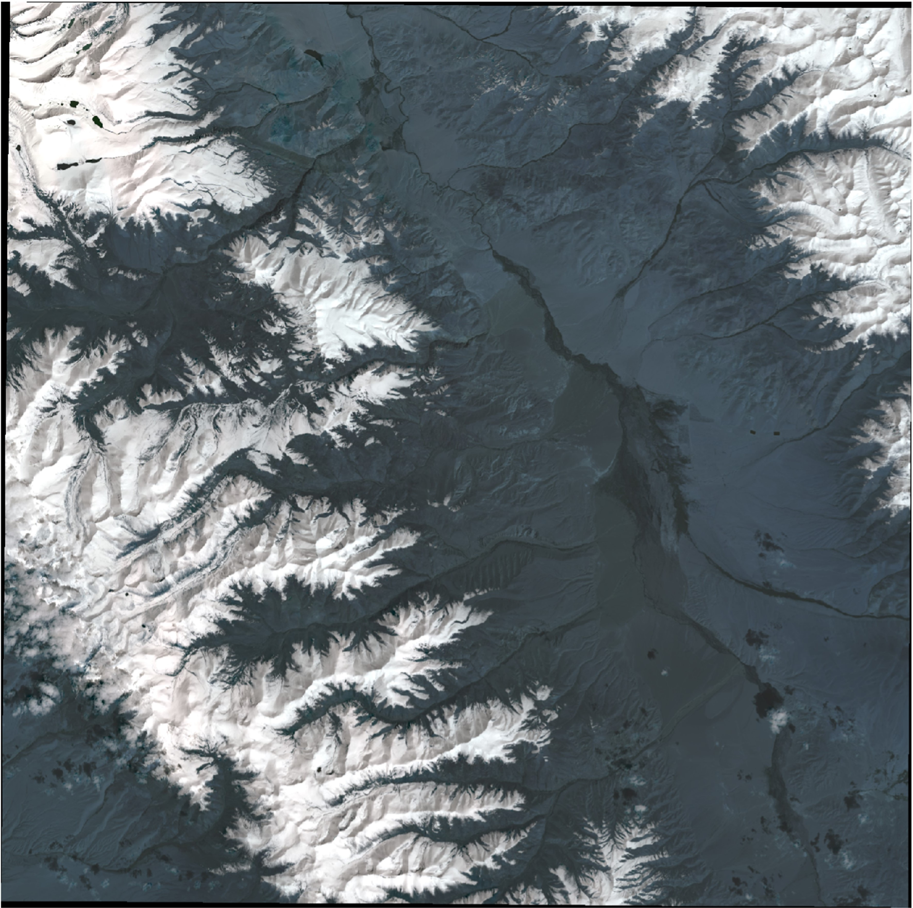
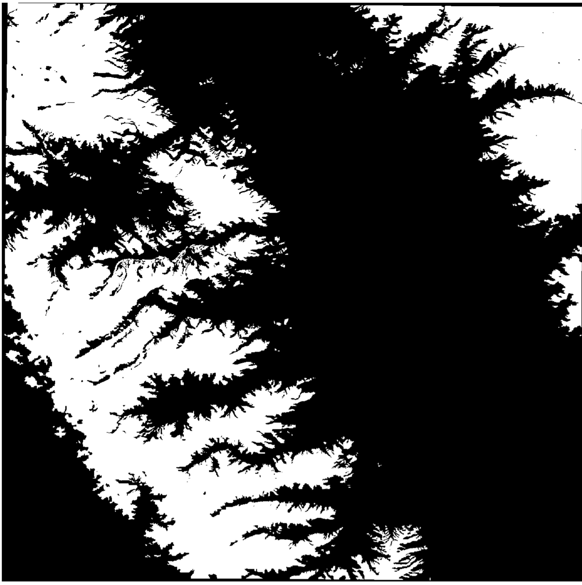

# Global High-Precision Glacier Interpretation Dataset

To address the scarcity of high-quality training data in glacier mapping, we present a new **global glacier interpretation dataset** designed to overcome the limitations of traditional inventories (e.g., RGI) in terms of **temporal currency, labeling consistency, and scene diversity**.

---

## Coverage and Sampling Strategy

- **Geographic scope**: Covers major glacierized regions including **High Mountain Asia, the European Alps, and Alaska**, with additional high-latitude examples.
- **Challenging scenarios included**: debris-covered ice, topographic shadow, and frequent cloud/fog interference.
- **Current size**: **65 expert-labeled scenes** (and growing!).

---

## Data Sources and Spectral Bands

All images are acquired between **August and October** (late ablation season) to minimize seasonal snow contamination. We use six harmonized spectral bands and fuse a 30 m elevation model (ALOS AW3D30).

| Platform     | Sensor   | Selected Bands                                      | Resolution |
|--------------|----------|-----------------------------------------------------|------------|
| Landsat 5    | TM       | SR_B1, SR_B2, SR_B3, SR_B4, SR_B5, SR_B7           | 30 m       |
| Landsat 7    | ETM+     | SR_B1, SR_B2, SR_B3, SR_B4, SR_B5, SR_B7           | 30 m       |
| Landsat 8/9  | OLI      | SR_B2, SR_B3, SR_B4, SR_B5, SR_B6, SR_B7           | 30 m       |
| Sentinel-2   | MSI      | B2, B3, B4, B8, B11, B12                           | 30 m*      |
| ALOS         | PRISM    | AW3D30 (Elevation)                                 | 30 m       |

> *Sentinel-2 bands are resampled from native 10–20 m to 30 m.  
> Landsat-7 data is restricted to 1999–2003 to avoid SLC-off gaps.

---

## Preprocessing and Dataset Splits

- **Cloud processing**: Cloud masking and band compositing performed on **Google Earth Engine (GEE)**.
- **Local processing**: 65 scenes split into **50 for training** + **15 for validation**.
- **Input format**: 7-channel tensors (6 spectral bands + 1 elevation channel)
- **Training set**: per-scene normalization + data augmentation (rotation, flipping, gamma, noise, etc.) + random 512×512 cropping
- **Validation set**: same normalization and fusion, **no augmentation**, regular-grid 512×512 cropping for reproducible evaluation

All glacier boundaries were **manually delineated by experts** and **cross-reviewed** for high label accuracy.

---

## Dataset Visualization

> *Left: Thumbnail mosaic of all 65 labeled scenes; Right: Global distribution of sample locations.*

---

## Labeling Examples

#### **Example 1**

| Input Image | Ground Truth Mask |
|-------------|-------------------|
|  |  |

---

#### **Example 2**

| Input Image | Ground Truth Mask |
|-------------|-------------------|
|  |  |

---