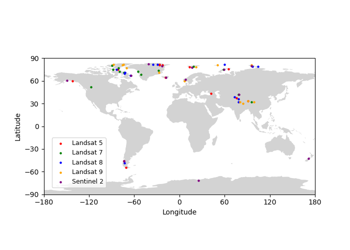
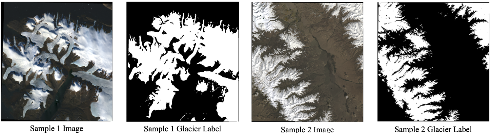
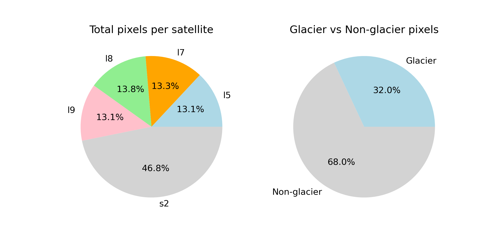

# glacier_mapping
**glacier dataset for deep leaning**
### --- **Title**   
**Deep learning-based glacier mapping using Landsat-5, 7, 8 , 9 images and Sentinel 2 images .**
### -- **Content**
- Tutorial of remote sensing image acquisition and groud truth labeling.    
- Tutorial of remote sensing data loader for deep learning.    
- Tutorial of deep learning model building (take unet as example).     
- Tutorial of deep learning model training and validation.    
### -- **Ongoing image labeling**
- Number of labeled image reach to 65!! :tada:    
- If you are interested in this propject, welcome to join us! :clap:

### -- **Glacier labeling method** 
todo

### Todo  
1. convert data-down/*.js to python code (ref: https://github.com/Hydrological-Observation-Group/Yunnan-Guizhou-Plateau/tree/main/data_down/water_dset_from_gee). 
2. re-download data that fall in 60N-90N and 60S-90S, set the crs to EPSG:3413 and EPSG:3031. 
3. expand data to ~100 scenes. 
4. compare the common deep learning models (unet, deeplabv3+, deeplabv3plus_mobilev2, unet+) in glaicer mapping (visual/methods_metrics.ipynb).      

